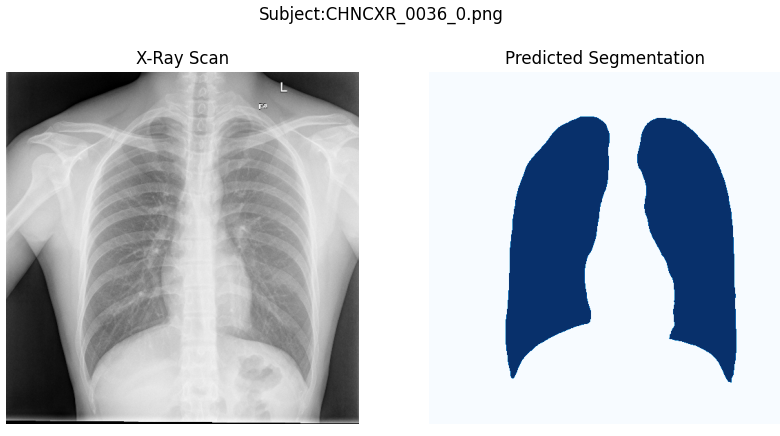

# Attention U-Net for Lung Segmentation on Chest Xray Scans

This repository contains code (training and inference) for Attention U-Net for the lung segmentation on Chest Xray scans.\
Train file:\
train.py \
Inference file:\
inference.py\
Helper functions:\
attention_unet.py\
utilities.py

# How to run in Google Colab (as you might want to bring into use the GPU capability)

1. Clone the repository into a Colab session
2. The data has to be located in the Google Drive in the exact same setting of diretories as mentioned in the code
3. Adjust the paths of directories containing dataset in your computer accordingly
4. Run the script train.py to train the best model
5. Find out the best model parameters using the validation loss column in the logs file
6. Run the script inference.py to load and run the exact same model

Note: You can run the repository in your local in the exact same manner as in Google Colab

[Click here to access the dataset on Kaggle](https://www.kaggle.com/datasets/nikhilpandey360/chest-xray-masks-and-labels)
